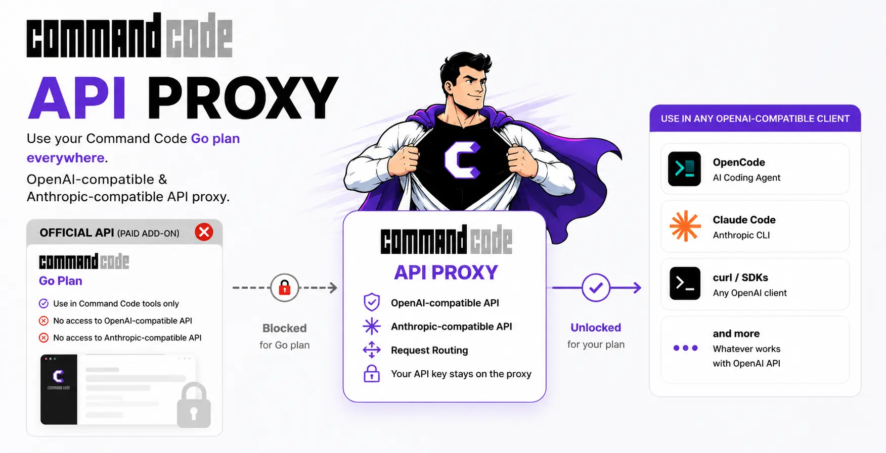

<a href="#"></a>

# Command Code API Proxy

[](https://www.npmjs.com/package/commandcode-api-proxy)
[](https://www.npmjs.com/package/commandcode-api-proxy)

**OpenAI-compatible API proxy for [Command Code](https://commandcode.ai).**
Use your Command Code subscription from **any** OpenAI-compatible client — OpenCode, Claude Code, or plain `curl`.

## Why?

Command Code exposes two API surfaces:

| Surface                         | Protocol                      | Plan required                   |
| ------------------------------- | ----------------------------- | ------------------------------- |
| `/provider/v1/chat/completions` | OpenAI-compatible             | **Provider** tier (paid add-on) |
| `/alpha/generate`               | Custom (Vercel AI SDK stream) | Your standard subscription      |

This proxy talks `/alpha/generate` upstream and standard OpenAI downstream — so your existing plan works from any tool.

## Run the proxy

```bash
# Clone & run from source
git clone https://github.com/thaolaptrinh/commandcode-api-proxy.git
cd commandcode-api-proxy
npm install
npm run build && npm start

# Or run directly (no install)
npx commandcode-api-proxy

# Or install globally
npm install -g commandcode-api-proxy
commandcode-api-proxy
```

On first run, the proxy prompts for your Command Code API key (get it from
https://commandcode.ai/settings). Other ways to provide it are in
[Authentication](#authentication).

## Authentication

Provide your API key via `--api-key`, the `CC_API_KEY` env var, or save it
with `auth login` (stored at `~/.config/commandcode-api-proxy/auth.json`).

### CLI auth commands

> From source, replace `commandcode-api-proxy` with `npm run auth --`
> (e.g. `npm run auth -- login`).

```bash
# Save a new API key
commandcode-api-proxy auth login

# Overwrite existing key
commandcode-api-proxy auth login --force

# Remove saved key
commandcode-api-proxy auth logout
```

## CLI options

| Option                | Description                       | Default     |
| --------------------- | --------------------------------- | ----------- |
| `--host`              | Bind address                      | `127.0.0.1` |
| `--port`              | Port                              | `8787`      |
| `--api-key`           | Command Code API key              | —           |
| `--setup-opencode`    | Generate OpenCode provider config | —           |
| `--setup-claude-code` | Generate Claude Code model config | —           |

Equivalent env vars (lower priority than CLI flags):

| Env var                  | Description                                                                                                             |
| ------------------------ | ----------------------------------------------------------------------------------------------------------------------- |
| `HOST`                   | Bind address                                                                                                            |
| `PORT`                   | Port                                                                                                                    |
| `CC_API_KEY`             | Command Code API key                                                                                                    |
| `CC_API_BASE`            | Upstream API base URL                                                                                                   |
| `CC_CLI_VERSION`         | CLI version sent upstream                                                                                               |
| `CC_UPSTREAM_TIMEOUT_MS` | Max ms for upstream to return response headers + first byte (default `600000` / 10 min). Bump for slow reasoning models |
| `CC_IDLE_TIMEOUT_MS`     | Max ms between consecutive stream chunks (default `120000` / 2 min). `0` disables — detects stalled upstreams            |
| `LOG_LEVEL`              | Log level (`info`, `debug`, etc.)                                                                                       |
| `CORS_ORIGIN`            | `Access-Control-Allow-Origin` value. `*` by default; empty string disables CORS. Restrict before exposing on a network. |

> **Security:** the proxy forwards your paid Command Code key upstream and
> accepts any auth token from clients (`proxy-managed`), so it is designed for
> **localhost** use (`HOST=127.0.0.1`). Do not bind it to `0.0.0.0` on an
> untrusted network without restricting `CORS_ORIGIN` and putting your own auth
> in front.

## Endpoints

| Endpoint                         | Protocol  |
| -------------------------------- | --------- |
| `GET /health`                    | —         |
| `GET /v1/models`                 | OpenAI    |
| `POST /v1/chat/completions`      | OpenAI    |
| `POST /v1/messages`              | Anthropic |
| `POST /v1/messages/count_tokens` | Anthropic |

All endpoints accept any auth token (use `proxy-managed`) — the proxy injects
your real Command Code key upstream.

## Client configuration

### OpenCode

Run setup to auto-generate the provider config at `~/.config/opencode/opencode.json`:

```bash
npx commandcode-api-proxy --setup-opencode
```

All CC models are listed directly — pick the one you want from the model selector.

Or add a `commandcode` provider manually — point `baseURL` at the proxy and
use any model ID from the [Model aliases](#model-aliases) table:

```json
{
  "$schema": "https://opencode.ai/config.json",
  "provider": {
    "commandcode": {
      "npm": "@ai-sdk/openai-compatible",
      "name": "Command Code",
      "options": {
        "baseURL": "http://127.0.0.1:8787/v1",
        "apiKey": "proxy-managed"
      },
      "models": {
        "deepseek-v4-pro": { "name": "DeepSeek V4 Pro" }
      }
    }
  }
}
```

### Claude Code

Claude Code only offers three tiers — `sonnet`, `opus`, `haiku`. The setup
maps each tier to a Command Code model via env vars in `claude-settings.json`:

```bash
npx commandcode-api-proxy --setup-claude-code
```

If a settings file already exists, re-run with `--force` to overwrite it.

| Claude Code tier | Env var                          | Maps to                      |
| ---------------- | -------------------------------- | ---------------------------- |
| `sonnet`         | `ANTHROPIC_DEFAULT_SONNET_MODEL` | `deepseek/deepseek-v4-pro`   |
| `opus`           | `ANTHROPIC_DEFAULT_OPUS_MODEL`   | `deepseek/deepseek-v4-pro`   |
| `haiku`          | `ANTHROPIC_DEFAULT_HAIKU_MODEL`  | `deepseek/deepseek-v4-flash` |

Edit those env vars in the settings file to point at other CC models. To force
every `claude-*` request to a single model regardless of tier, set
`ANTHROPIC_DEFAULT_MODEL`. Then run:

```bash
claude --settings ~/.config/commandcode-api-proxy/claude-settings.json
```

Or set an alias:

```bash
alias claude-proxy="claude --settings ~/.config/commandcode-api-proxy/claude-settings.json"
claude-proxy
```

## Model aliases

Short names work in addition to full model IDs:

| Alias                                            | Maps to                               |
| ------------------------------------------------ | ------------------------------------- |
| `deepseek-v4-pro`, `deepseek-v4`, `deepseek-pro` | `deepseek/deepseek-v4-pro`            |
| `deepseek-v4-flash`, `deepseek-flash`            | `deepseek/deepseek-v4-flash`          |
| `glm-5.2`, `glm5.2`                              | `zai-org/GLM-5.2`                     |
| `glm-5.2-fast`, `glm5.2-fast`                    | `zai-org/GLM-5.2-Fast`                |
| `glm-5.1`                                        | `zai-org/GLM-5.1`                     |
| `glm-5`                                          | `zai-org/GLM-5`                       |
| `minimax-m3`, `minimax3`                         | `MiniMaxAI/MiniMax-M3`                |
| `minimax-m2.7`, `minimax2.7`                     | `MiniMaxAI/MiniMax-M2.7`              |
| `minimax-m2.5`, `minimax2.5`                     | `MiniMaxAI/MiniMax-M2.5`              |
| `kimi-k3`, `kimi3`                               | `moonshotai/Kimi-K3`                  |
| `kimi-k2.7-code`, `kimi-code`                    | `moonshotai/Kimi-K2.7-Code`           |
| `kimi-k2.7-highspeed`, `kimi-highspeed`          | `moonshotai/Kimi-K2.7-Code-Highspeed` |
| `kimi-k2.6`, `kimi2.6`                           | `moonshotai/Kimi-K2.6`                |
| `kimi-k2.5`, `kimi2.5`                           | `moonshotai/Kimi-K2.5`                |
| `qwen3.7-max`, `qwen-3.7-max`                    | `Qwen/Qwen3.7-Max`                    |
| `qwen3.7-plus`, `qwen-3.7-plus`                  | `Qwen/Qwen3.7-Plus`                   |
| `qwen3.6-max`, `qwen-3.6-max`                    | `Qwen/Qwen3.6-Max-Preview`            |
| `qwen3.6-plus`, `qwen-3.6-plus`                  | `Qwen/Qwen3.6-Plus`                   |
| `step-3.7-flash`, `step3.7`                      | `stepfun/Step-3.7-Flash`              |
| `step3.5`, `step-3.5-flash`                      | `stepfun/Step-3.5-Flash`              |
| `mimo-v2.5-pro`, `mimo-pro`                      | `xiaomi/mimo-v2.5-pro`                |
| `mimo-v2.5`, `mimo2.5`                           | `xiaomi/mimo-v2.5`                    |
| `grok-4.5`, `grok4.5`                            | `xai/grok-4.5`                        |
| `nemotron`, `nemotron-3-ultra`                   | `nvidia/nemotron-3-ultra-550b-a55b`   |
| `inkling`                                        | `thinkingmachines/inkling`            |
| `hy3`                                            | `tencent/Hy3`                         |

Any model ID is passed through as-is — the proxy does not validate against a fixed list.

### Reasoning effort

Some models support a `reasoning_effort` (`low` | `medium` | `high` | `xhigh` | `max`), and
each accepts a different subset. The proxy sends the closest valid level for the model
(e.g. `deepseek-v4-pro` supports only `high`/`max`, so `low` is clipped up to `high` and
`max` is reachable). Models without a discrete effort set ignore the value. Pass the
effort via OpenAI's `reasoning_effort`, or Anthropic's `thinking.budget_tokens`
(larger budget → higher effort).

## License

MIT
